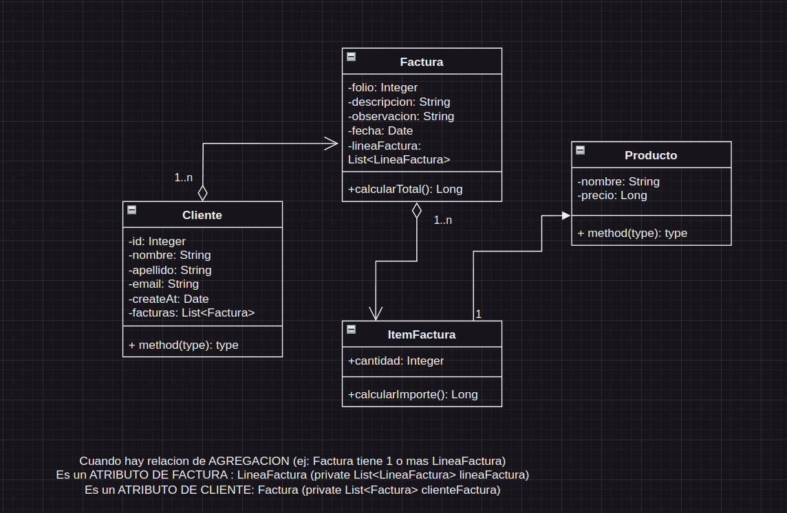

# CONTINUACION DEL CURSO COMPLETO DE SPRING & SPRING BOOT

# Seccion 8 - Spring MVC & Data JPA: Desarrollando una aplicacion desde cero

## 1) Creando la clase Entidad JPA anotada con @Entity

    - Creamos el model de cliente con la notacion @Entity
    - IMPLEMENTAMOS SERIALIZABLE! -> Recomendado
    - @Table para que cree la tabla en la base de datos (h2 ejemplo)
    - Atributos, getters and setters!
        -> Para que en la tabla tenga un nombre distinto del atributo -> @Column

## 2) Creando la clase de Acceso a Datos o DAO con Entity Manager - @Repository

    - Clase de acceso a dato DAO, se encarga de acceder a los datos
    - Creamos el package 'dao' (data access object)
    - Creamos la clase 'IClienteDao' -> Interfaz de cliente DAO

    - MARCAMOS LA CLASE COMO @Repository -> IMPORTANTE! Componente de persistencia de acceso a datos

    - EntityManager -> Se encarga de manejar las clases de entidades, ciclo de vida y las persiste, actualiza y eliminar.
    Todas las operaciones a la base de datos pero a nivel de OBJETO!

    - SI NO ACLARAMOS LA BASE DE DATOS A LA CUAL NOS CONECTAREMOS EN EL application.properties, SPRING SE CONECTARA, 
    COMO DEFAULT, A LA BASE DE DATOS DE SPRING 'h2' que la tenemos en dependencias del pom.xml

## 3) Creamos el controlador que va a manejar el metodo handler para listar la cantidad de clientes

    - Package -> controllers
    - Clase controlador -> ClienteController
    - Implementamos el GetMapping con el model como veniamos trabajando para pasar a la vista "listar"
    el listado de clientes luego de inyectar el repository de JPA de clientes

## 4) Creamos la vista listar.html
    
    - Creamos la vista como veniamos haciendo con el each para la iteracion de clientes a mostrar
    - Un file 'import.sql' donde tendremos los ejemplos a insertar en la base de datos

    - PERFECTO! IT WORKS

## 5) Agregando estilos a la vista Listar con Bootstrap

    - Ver DOC de bootstrap; ez

## 6) La consola H2 Database

    - En application.properties -> spring.h2.console.enable=true
        -> Database: Ver el consola la URL de la base de datos generada
        -> User: sa 
        -> No Password

    - spring.datasource.url=jdbc:h2:mem:clientesdb PARA CAMBIAR EL NOMBRE DE LA BASE DE DATOS
    - spring.datasource.username=pablo
    - spring.datasource.password=pablo
    - spring.datasource.driver-class-name=org.h2.Driver

## 7) Agregando crear en Repositorio DAO y el Controlador

    - Creamos el metodo en la interface y lo implementamos en la clase de Implementacion del DAO
    - metodo 'persist' de EntityManager
        -> Toma el objeto cliente y lo guarda en el contexto de persistencia (JPA), una vez realizado el commit
        y el flush(), va a sincronizar con la base de datos y realizar el insert en la tabla (automatizado)

    - Agregamos en el controlador, un metodo GET para MOSTRAR LOS CLIENTES que se van a guardar luego con el POST
    - Metodo POST para agregar los clientes a la bd

## 8) Creando la clista crear y formulario

    - Creamos la vista con los parametros correspondiente

    - Colocamos en el modelo de Cliente un metodo prePersist() con createAt = new Date();
    Con @PrePersist se va a llamar a ese metodo justo antes de insertar el registro en la BD con el metodo PERSIST
    de JPA.

    - Agregamos los estilos correspondientes al formulario con bootstrap

## 9) Mejorando formulario con estilos de BootStrap CSS

## 10) Agregando campo fecha al formulario
    
    - Agregamos otro campo al form (html) como los anteriores y colocamos la fecha.
    - Quitamos del model CLientes, el prePersist de fecha
    - CUIDADO CON EL MYSMATCH DE DATA TYPE DE LA FECHA! -> Agregar el @DateTimeFormat para matchear con el type="date" del form

## 11) Agregando reglas de validacion usando anotaciones

    - VALIDACIONES! usaremos en la clase entity -> Bean Validation 2.0
    - Agregamos la anotaciones pertinentes para la validacion en la clase entity

    - AHORA IMPORTANTE! -> DENTRO DEL CONTROLADOR TENDREMOS QUE MANEJAR LOS ERRORES!

        -> @Valid en el POST MAPPING PARA VALIDAR! PASO MUY IMPORTANTE!
        -> SI FALLA, debemos mostrar nuevamente la plantilla del formulario con los errores correspondientes
        -> BindingResult y con el if manejamos si posee errores devolvemos la vista nuevamente
    
            - SIEMPRE JUNTOS EL "@Valid Cliente cliente, BindingResult result" SIEMPRE JUNTOS UNO A LADO DEL OTROS

    - Una vez listo, nos vamos a la VISTA para manear los errores

## 12) Agregando mensajes de errores personalizados

    - Creamos el message.properties como el anterior proyecto para manejar los errores
    
## 13) Agregando mensajes de errores sobre el formulario

    - En la vista 'form' podemos agregar una etiqueta para acceder al cliente, los msj de errores, etc.
        

            <ul th:if="${#fields.hasErrors('*')}" class="alert alert-danger">    
                <li th:each="err: ${#fields.hasErrors('*')}" th:text="${err}"></li>
            </ul>
        

## 14) Agregando EDITAR clientes

    - En el controlador, metodo para EDITAR.

    A DIFERENCIA DEL HIDDEN ID, UNA BUENA PRACTICA ES USAR EL SESSIONATTRIBUTE! MUCHO MAS SEGURO Y RECOMENDADA

    - @SessionAttributes para guardar los datos del cliente en la sesion y finalizar cuando llamemos al metodo guardar
    Con SessionStatus status y dentro del metodo luego de guardar status.setComplete();

## 15) Agregando ELIMINAR clientes
    
    - Debemos colocar el en 'contrato' interface, el delete method para eliminar 

    - El delete, busca por ID que recibe como parametro en la BD y cuando lo encuentra, lo elimina

    EL PROCESO -> 
        1 - Implementamos en el Interface del DAO el metodo eliminar
        2 - Sobreescribimos dicho metodo en la IMPLEMENTACION del DAO cliente de la clase
        3 - Agregamos al controlador el metodo correspondiete para la eliminacion del cliente
        4 - Modificamos en la VISTA para agregar esta accion de eliminar

## 16) Agregando la clase Service

    - Creamos la interface del IClienteService y luego la Clase de implementacion de dicha interface
    - Anotacion @Service -> Patron de diseno FACHADE o fachada (ver +)
    - DAO y SERVICE (4 clases para la implementacion). SERVICE -> FACADE PATTERN!

## 17) Implementando el DAO con la interface CrudRepository

    - Como implementar nuestro componente de accesos a datos de manera simple con -> CrudRepository de JPA
    - Mirando en la documentacion de CrudRepository in JPA Data

            public interface CrudRepository<T (TIPO DE DATO DE LA CLASE ENTITY), ID (TIPO DE DATO DEL ID) > extends Repository<T, ID> {

                <S extends T> S save(S entity);      
            
                Optional<T> findById(ID primaryKey);
                
                Iterable<T> findAll();
                
                long count();
                
                void delete(T entity);
                
                boolean existsById(ID primaryKey);
                
                // … more functionality omitted.
            }

    - TODA LA CONSTRUCCION YA ESTA GENERADA AUTOMATICAMENTE POR SPRING, lo que hacemos es 'invocar' el esqueleto
    y SPRING JPA se encargara del resto

    - Consultas personalizadas? (como las que hicimos?)

        -> Lo podemos implementar tambien, usando la anotacion @Query ! 
            Ejemplo: @Query("select u from User u")
                     Stream<User> findAllByCustomQueryAndStream();
        -> Utiliza Query pero a nivel de Objeto!

    - Query Methods -> Example: findByEmailAddressAndLastname(String emailAddress, String lastname);

    - Implementacion en el proyecto!
    
        -> Eliminamos ClienteDaoImplementation ya que modificaremos la interface para IClienteDao
        -> Lo dejamos asi nuestra IClienteDao y eliminamos los metodos que habiamos creado
        -> AHORA DEBEMOS IR A ClienteServiceImplementation y modificamos los metodos con errores asociados
            - getById(id).orElse(null);
            - deleteById(id);
            - (List<Cliente>) clienteDao.findAll()

    - ENTONCES ESTE SERIA EL SUMARIO

        RoadPath!

            ClienteDAO (CrudRepository inheritance) -> ClienteService (interfaz) -> ClienteServiceImplementation (Logica)
            -> ClienteController (Request) -> Vista (HTML, CSS & JS) 

## 18) Usando MYSQL para el proyecto!

    - Agregamos la conexion de MySQL en application properties, cambiamos h2 por mySQL
    - PARA TESTING la siguiente configuracion: spring.jpa.hibernate.ddl-auto=create-drop (SOLAMENTE PARA DESARROLLO, PRUEBA DE DATOS)
        -> EN PRODUCCION DEBEMOS QUITAR ESTA CONFIGURACION Y TENER LAS TABLAS CREADAS ANTES DEL DEPLOY
        
    - Para que nos muestre las consultas SQL nativas que genera JPA y nos muestre en terminal   
        -> loggin.level.org.hibernate.SQL=debug

# FINALIZADA LA SECCION DEL DESARROLLO DEL CRUD COMPLETO!

# SIGUIENTE SECCION -> BONUS DEL PROYECTO CRUD, ALGUNAS MEJORAS

## 1) Bonus Track: Layout usando fragments en Thymeleaf

    - Varias acciones que se repiten en varias paginas de la app, como el header de la app
    - Podriamos tener una aplicacion con varias vista y es poco efectivo repetir en cada vista el mismo codigo
    - EJ -> MENU, PIE DE PAGINA, HEADER.. 
    - OPTIMIZACION

        -> AGREGAMOS th:fragment en las etiquetas que queremos optimizar. Ej en <head> -> <head th:fragment:"head">
        -> EN LAS VISTAS agregamos th:replace con el nombre del fragment

## 2) Bonus Track: Layout usando fragments en Thymeleaf - Parte II

    - Usando PANELES (cards) by bootstrap

## 3) Bonus Track: Paginador desde cero - Usando PagingAndSortingRepository - Parte I

    - Componente de Spring DATA, Paginacion: Nos facilita el manejo de informacion de clientes
    - Pagina Actual y cantidad de elementos a mostrar en la pagina

    - Vamos a IClienteDao y de ahi manejamos la herencia de PagingAndSortingRepository<Cliente, Long>
        -> Paginating... AGREGAMOS JUNTO A CRUDREPOSITORY, NO PROBLEM! (No longer embeded with crudRepository)

    - DOS FORMAS -> public interface IClienteDao extends JpaRepository<Cliente, Long>
                 -> public interface IClienteDao extends PagingAndSortingRepository<Cliente, Long>, CrudRepository<Cliente, Long>

## 4) Bonus Track: Paginador desde cero - La clase PageRender y controlador - Parte II

    - Clase para el paginador PageRender dentro del nuevo package 'util'

## 5) Bonus Track: Paginador desde cero - La clase PageRender y controlador - Parte III

## 6) Bonus Track: Paginador desde cero - La clase PageRender y controlador - Parte IV

# Continuacion con la SECCION 9 - Subida de Imagenes en el proyecto

## 1) Configuraciones y preparacion de la aplicacion

    - En el template base (listar) agregamos en el form -> enctype="multipart/form-data" (Nos permite enviar archivos como data)
    - En el application properties colocamos el max size para los archivos de subida
    - Agregamos en el entity el atributo para la subida de foto y demas.
    - Agregamos el campo en el import de sql y seguimos.

## 2) Agregando campo file en formulario y procesar MultipartFile en el Controlador

    - Agregamos en la vista el input dentro del form para la subida de archivo
    - En el controlador lo agregamos dentro del guardar el atributo correspondiente 
        -> En guardar: @RequestParam(name = "file") MultipartFile foto.
    - Agregamos la logica necesaria en el controlador para el upload de image para cada cliente

## 3) Agregando metodo handler ver imagen en el Controlador

    - Metodo handler 'ver' para la muestra del cliente con su foto

## 4) Creando la vista 'ver' para visualizar la imagen

    - Creamos el template 'ver' html file
    - Creamos el metodo handler para el manejo de la foto con el return de la vista html 'ver'

## 5) Agregar directorio uploads externo al proyecto (Resource Handler)

    - La idea es guardar el directorio externo de la app.
    - Eliminamos uploads de nuestros resources
    - En el metodo guardar y modificamos la ruta, ya no esta en los recursos static
        -> Path directorioRecursos = Paths.get("src//main//resources//static/uploads"); (LO QUITAMOS)
        -> y modificamos ESTO: String rootPath = directorioRecursos.toFile().getAbsolutePath();
            -> POR ESTO : String rootPath = "/home/pablo/uploads";

    -> IMPORTANTE : Se guarda en la ruta fisica de nuestro proyecto que estamos desarrollando (codigo fuente)
                    y no en el compilador JAR (O WAR)

    
    - DEBEMOS REGISTRAR EN MVCCONFIG el path del directorio para el uploads de imagenes (VER MAS)

## 6) Agregar directorio absoluto y externo en raiz del proyecto

    - Agregamos un directorio externo pero dentro del proyecto, que las img esten dentro de un directorio en la raiz de nuestro
    proyecto, modificando el handler con el MvcConfig

    - Cambios en el Controlador, creamos un path .. FORMA MAS COMPLICADA .. VER MAS PARA ENTENDER!

## 7) Eliminar archivo de imagen para clientes

    - Vamos dentro del handler de eliminar cliente, vemos alli el eliminar 

## 8) La clase UploadFileService

    - Automatizacion del controlador, desacoplaremos algunas funciones de la logica de negocio para un servicio
    - EN este caso para la subida de imagen, asi 'limpiamos' el controlador

## 9) Inicializando directorio uploads automaticamente usando CommandLineRunner

    - En la clase principal de nuestra aplicacion de Spring boot
    - Implementamos en el service de IUploadFileService los metodos deleteAll y Init para el manejo del directorio
    - Implementamos los metodos en la clase de implementacion del service de IUploadFileService

    - En la clase main de la aplicacion, Inyectamos el service y dentro del run del implement de CommandLineRunner
      Agregamos los metodos deleteAll y Init dentro para que elimine y despues cree el directorio automaticamente

# CONTINUACION DEL CURSO COMPLETO DE SPRING & SPRING BOOT

# Seccion 11 - Spring MVC + Data JPA + JQuery: Desarrollando un sistema de facturacion

## 1) Analisis y Diseno OO con UML Diagrama de clases del dominio

    - Ver diagrama en draw.io (SpringFacturacion) en dispositivo
    - Diagrama 

## 2) Asociaciones: ManyToOne Bidireccional - Clases Entity Factura y Cliente (ver diagrama)

    - Creamos el entity de FACTURA y lo relacionamos con CLIENTE a traves de @ManyToOne y @OneToMany
        -> SEGUN HEMOS DIAGRAMADO EN NUESTRO UML de FACTURACION

## 3) Asociaciones: OneToMany Unidireccional - Clase Entity Factura y ItemFactura (ver diagrama)

    - Una FACTURA -> MUCHOS itemFactura y nada mas! No es en ambos sentidos
    - Creamos el entity para ITEMFACTURA y lo relacionamos UNIDIRECCIONALMENTE (@JoinColumn) con FACTURA

## 4) Asociaciones: ManyToOne Unidireccional - Clases Entity ItemFactura y Producto (ver diagrama)

    - Creamos la clase PRODUCTO con toda su config inicial
    - en ITEMFACTURA tenemos una relacion con PRODUCTO, por lo que es atributo de itemfactura

    -> RESUMEN:
        - CLIENTE: Relacion con VARIAS FACTURAS, BIDIRECCIONAL. Cliente tiene VARIAS FACTURAS y FACTURA tiene UN cliente (@OneToMany)
        - FACTURA: Relacion con UN CLIENTE, BIDIRECCIONAL. VARIAS FACTURAS puede tener UN solo cliente (@ManyToOne) / tiene MUCHOS items
        - ITEMFACTURA: Relacion con PRODUCTO, solo con PRODUCTO. ya que con FACTURA es UNIDIRECCIONAL. Item NO necesita a FACTURAS
        - PRODUCTO: Relacion con ITEM_FACTURA, solo con ITEM. es UNIDIRECCIONAL. PERO DESDE ITEM, solamente el ITEM tiene relacion
        con EL PRODUCTO, PARA OBTENER NOMBRE Y PRECIO y Producto NO Necesita la relacion con ITEM

        - METODOS
            -> en ITEM_FACTURA: calcularImporte para calculcar el importe. EL total de la LINEA
            -> en FACTURA: calcularTotal para calcular el importe de CADA LINEA, de cada ITEMS para el total

## 5) Listando las facturas en la vista de detalle Cliente - ver.html

## 6) Creando controlador FacturaController con el handler de CREAR

    - Ver en el Controlador del handler CREAR en FACTURACONTROLLER

## 7) Creando la vista formulario para las facturas

    - Crear la vista del formulario -> form.html
    - Agregamos, como veniamos agregando, las etiquetas y el manejo del formulario

## 8) Links para acceder al formulario de CrearFactura

    - Agregar el enlace en el html de 'listar' para crear factura
    - Agregamos, tanto en, 'listar' como en 'ver' los links '<a>..' para crear factura
    - En la vista de 'factura' agregamos el boton de 'volver' para la vista de los clientes

## 9) Escribiendo codigo JavaScript para el AutoComplete usando JQuery UI

    - Descargar en la pagina oficial de JQuery el JQuery UI y agregar algunos archivos en el static/js y static/css
        -> jquery-ui.min.css y jquery.min.js

    - En template 'layout' agregamos la hoja de estilo de JQuery como agregamos el css 
    - Creamos el autocomplete para facturas dentro del template
    - Creamos un nuevo directorio 'js' para manejar el auto_complete desde alli para luego importarlo desde factura/form
    - Codificamos el script para el autocomplete dentro del <script>

## 10) Consulta JPA para buscar productos en el Autocomplete

    - Implementamos la clase e interface del modelo con 'crudRepository' para el model de producto
    - Implementamos el 'contrato' con el metodo 'findByNombre(term)'
    - LO INYECTAMOS en el ClienteServiceImplementation y sobreescribimos el metodo
    - Lo agregamos tambien en el IClienteService (fachada) para la implementacion

    - Ahora desde el controlador 'FacturaController' hacemos la implementacion 

    -> ERROR al no aparecer el autocomplete 
        . FIXED con importar correctamente el JQuery.css y js en el head del template del html (layout)

## 11) Creando la plantilla fragment para crear los items (ItemsFactura) de la factura con JQuery

    - Plantilla con parametros con id, nombre, precio .. se va a crear una linea a traves de esta plantilla con 
    los datos correspondientes
    - Creamos un HTML en 'factura' -> plantilla-items.html

## 12) Creando las lineas de la Factura usando JQuery y la plantilla de items

    - Crear las lineas de la factura, primero una tabla en form dentro de factura
    - Agregamos un <table> para dicha feature dentro del template
    - AHORA MODIFICAMOS EN AUTOCOMPLETE-PRODUCTOS EL JS PARA DICHA FEATURE 

## 13) Calculando el total de la linea o importe 

    - Calculo para el importe (precio * cantidad)
    - En factura/form agregamos la nueva col 'total;
    - EN plantilla item creamos la columna por cada linea
    - EN autocomplete-productos AGREGAMOS UNA NUEVA FUNCION PARA ESTE CALCULO! IMPORTANTE!

## 14) Incrementando cantidad de un producto existente en el detalle de la factura

    - En vez de crear una linea por cada producto (ya existente) lo acoplaremos al mismo 
    - Dentro del JS vamos a implementar (Ver + en codigo -> autocomplete-productos.html -> incrementarCantidad)

## 15) Eliminar linea de factura

    - Lo trabajaremos dentro del 'form' de factura, agregando una nueva columna en el form
    - Luego lo implementamos dentro del JS (autocomplete-productos.html)
    - Como siguiente, en la plantilla (plantilla-items.html) (<a> -> con la accion eliminar)

## 16) Calculando Gran Total de la Factura

    - En la vista 'form' de Factura, debajo de la tabla creamos un h5 con un SPAN 
    - Implementaremos dentro del JS como veniamos trabajando (autocomplete-productos.html)

## 17) Creando Crud Repository Factura e implementando save en clase Service

    - CrudRepository para las facturas con sus metodos para guardar las facturas en su service
    - Creamos la nueva interfaz para las facturas en la carpeta 'dao'
    - Dentro de service, vamos a IClienteService y agregamos un nuevo metodo saveFactura..
    - Luego implementamos dicho metodo en el CLienteServiceImplementation

## 18) Implementando metodo para buscar productos en el service

    - GUARDAR LA FACTURA CON SUS LINEAS EN LA BASE DE DATOS!
    - dentro de la interface service IClienteService creamos el metodo para buscar el producto por el ID
    - Implementamos dicho metodo en la clase ClienteServiceImplementation
    - Luego vamos a ItemFactura (relacion con producto) y creamos los getter y setter para producto

## 19) Implementando metodo handler guardar en FacturaController

    - Metodo guardar: toda la logica para poder persistir y guardar la factura usando el clienteService
    - Agregamos el metodo handler con la logica (guardar) dentro del controlador FacturaController (ver codigo)
    - Eliminamos dentro de plantilla-items.html el tbody con la plantillaItemsFactura, no se tiene que enviar el input y demas.
    - VEMOS Dentro del JS despues del autocomplete..

## 20) Validando el formulario de la Factura
        
    - Validar el formulario de la factura, al menos se tiene que validar, descripcion y detalle de factura al menos una linea!
    - En entity factura.
    - @Valid en el controlador para validar el objeto factura
    - BindingResult para comprobar si hubieron errores en dicha validacion
    - Modificamos la lista formulario (form) de la Factura dentro de 'descripcion'
    - Validar que las lineas, dentro del controlador, sean distintas de vacio

## 21) Creando metodo ver detalle en FacturaController

    - Pagina de detalle de la factura -> ICLienteService: findFacturaById.
    - IMPLEMENTAMOS el metodo en el CLienteServiceImplementation, el contrato del IclienteService
    - Implementamos el metodo en facturaController para ver la factura por ID.

## 22) Creando la vista VER detalle: Parte I - Datos de la factura

    - Creamos la vista dentro del folder de factura -> ver.html
    - Vamos a la vista del cliente en template/ver y agregamos una nueva columna 'ver' para ver el detalle

## 23) Creando la vista VER detalle: Parte II - Lineas de la Factura

    - Agregaremos las lineas de factura en el template de 'ver' en factura
    - Agregamos un par de tags html dentro de la vista para el manejo de los datos de la factura

## 24) Creando la vista VER detalle: Parte III - Observacion de la Factura

    - Agregamos la observacion dentro del 'ver' de factura, debajo del gran total agregamos la observacion
    
## 25) Eliminando la factura y sus lineas

    - Metodo deleteFactura en la clase service (IClienteService)
    - IMPLEMENTAMOS dicho metodo del contrato en el IClienteServiceImplementation
    - AHORA DENTRO del controlador agregamos dicho metodo (GetMapping) para la eliminacion de la factura con sus lineas
    (FacturaController)
    - En la plantilla 'ver' del cliente -> Agregamos el boton de eliminar con el enlace

## 26) Analizando configuracion Cascade All en guardar y eliminar factura

# Seccion 12 - Mejorando la aplicacion Sistema de Facturacion

## 1) Optimizando consulta JPQL en Factura con JOIN FETCH para obtener los items

    - GetCliente realiza una consulta a la tabla 'clientes' de forma peresoza (FetchType.LAZY)
    - Lo mismo sucede con las Lineas de Factura, por cada linea consulta a la tabla productos (1 itemFac -> Producto)
            -> EN el ejemplo, realiza 6 consultas!
            select c1_0.id,c1_0.apellido,c1_0.create_at,c1_0.email,c1_0.foto,c1_0.nombre from clientes c1_0 where c1_0.id=?
            select i1_0.factura_id,i1_0.id,i1_0.cantidad,i1_0.producto_id from facturas_items i1_0 where i1_0.factura_id=?
            select p1_0.id,p1_0.create_at,p1_0.nombre,p1_0.precio from productos p1_0 where p1_0.id=?
            select p1_0.id,p1_0.create_at,p1_0.nombre,p1_0.precio from productos p1_0 where p1_0.id=?
            select p1_0.id,p1_0.create_at,p1_0.nombre,p1_0.precio from productos p1_0 where p1_0.id=?
            select p1_0.id,p1_0.create_at,p1_0.nombre,p1_0.precio from productos p1_0 where p1_0.id=?

    - Podemos hacer UNA sola consulta usando JOIN FETCH by JPA
        -> Una sola consulta usando JOIN

    (PASOS MECANICOS)
    - En la interfaz de facturaDao creamos un nuevo metodo ..
    - Creamos el metodo en la interfaz SERVICE para dicho metodo del facturaDao
    - IMPLEMENTAMOS el metodo en la clase Service (ClienteServiceImplementation)
    - ULTIMO PASO, implementar la request en el CONTROLADOR FacturaController
        -> EN el metodo 'ver' usamos el nuevo metodo con el JOIN

    - LA CONSULTA DEL FINAL!

            select f1_0.id,c1_0.id,c1_0.apellido,c1_0.create_at,c1_0.email,c1_0.foto,c1_0.nombre,f1_0.create_at,f1_0.descripcion,i1_0.factura_id,i1_0.id,i1_0.cantidad,p1_0.id,p1_0.create_at,p1_0.nombre,p1_0.precio,f1_0.observacion 
            from facturas f1_0 join clientes c1_0 on c1_0.id=f1_0.cliente_id join facturas_items i1_0 on f1_0.id=i1_0.factura_id join productos p1_0 on p1_0.id=i1_0.producto_id where f1_0.id=?

## 2) Optimizando consulta JPQL en Cliente con JOIN FETCH para obtener las facturas

    - Optimizando la consulta 'detalle de cliente', una sola consulta a cliente para que traiga todas sus facturas
    (PASOS MECANICOS)
    - En IClienteDao implementamos el metodo con JOIN FETCH para traer todas las facturas sin carga perezosa
    - Creamos el metodo en la interfaz SERVICE para el metodo que acabamos de crear en el DAO de cliente
    - IMPLEMENTAMOS el metodo en la clase Service (ClienteServiceImplementation) como VENIAMOS HACIENDO 
    - MODIFICAMOS en el controlador ClienteController con el metodo y estaria

    -> CUIDADO! ERROR: Cuando queremos acceder a un cliente que NO tiene facturas, nos muestra el msj que no existe en la BD
        - PROBLEMA: Estamos realizando un INNER JOIN, relacionando dos tablas y va a traer todos los datos
        SI O SI exista la relacion (SIEMPRE Y CUANDO EXISTA LA RELACION: Existan facturas en nuestro caso)
        - FIX: CUANDO tenga o NO TENGA hay que hacer un LEFT JOIN (left join fetch)

# Y AQUI FINALIZA ESTE PROYECTO CON EL SIGUIENTE AVANCE

## APLICACION DESDE CERO -> CRUD DE CLIENTES A UNA BASE DE DATOS MYSQL
##                       -> MEJORA DE LA APP CON LAYOUTS, FLASH MESSENGER Y PAGINADOR DE CLIENTES
##                       -> SUBIDA DE IMAGENES AL PROYECTO CON SU CORRESPONDIENTE CODIFICACION p/ clientes (IUploadFileService.. etc)
##                       -> DESARROLLO DE UN SISTEMA DE FACTURACION COMPLETO CON TODOS SUS DETALLES
##                       -> MEJORANDO DICHO SISTEMA DE FACTURACION CON ALGUNAS FEATURES IMPORTANTES

# CONTINUAMOS CON EL MISMO PROYECTO PERO CON SPRING SECURITY EN CARPETA (ver spring-data-jpa-v2security)

